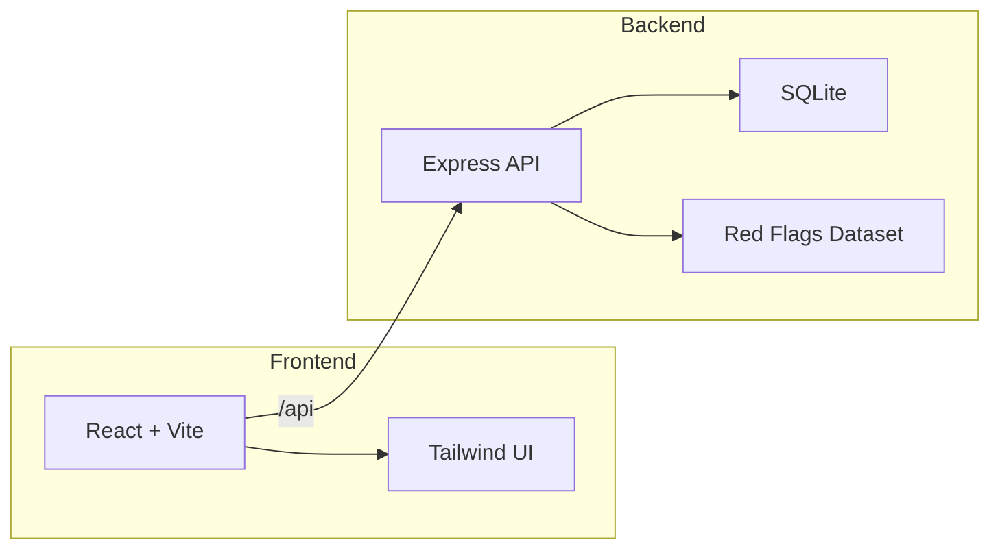

<div align="center">

# 🚩 Red Flag Scanner

**Upload a photo. Scan a profile. Get roasted.**

*A satirical web app that analyzes photos or social profiles and generates "red flags" — for entertainment only.*

[](https://react.dev/)
[](https://www.typescriptlang.org/)
[](https://vitejs.dev/)
[](https://tailwindcss.com/)
[](https://expressjs.com/)
[](https://www.sqlite.org/)

---

</div>

## ✨ What is this?

Red Flag Scanner is a **satirical** app that pretends to analyze your photos and social media profiles. It uses rule-based image analysis and a curated dataset of red flags — **no AI, no real APIs**. Just good old-fashioned vibes-based roasting.

> ⚠️ **Disclaimer:** This is satire. Don't take it seriously. We make it up.

---

## 🎯 Features

| Feature | Description |
| :--- | :--- |
| 📸 **Photo Upload** | Drag & drop or click to upload. Get red flags from aspect ratio, brightness, color analysis. |
| 🔍 **Profile Scan** | Enter Instagram, TikTok, or X username. Deterministic "analysis" (no real API calls). |
| ⚖️ **Compare Mode** | Pit two profiles against each other. Side-by-side red flag showdown. |
| 📤 **Share Results** | Copy, share, export as image. Shareable links at `/r/:id`. |
| 🔄 **Scan Again** | Same username, different flags. Random mode for endless roasting. |
| 📊 **Stats** | Total profiles scanned. Flex those numbers. |
| 🎨 **PWA Ready** | Install as an app. Roast on the go. |
| 🚫 **404 Page** | Custom error page. Even getting lost is a red flag. |

---

## 🛠 Tech Stack

| Layer | Technologies |
| :--- | :--- |
| **Frontend** | React 19, Vite 8, TypeScript, Tailwind CSS 4, React Router |
| **Backend** | Node.js, Express, TypeScript |
| **Database** | SQLite |
| **Logic** | Rule-based image analysis (sharp) + curated red flags dataset |



---

## 🚀 Quick Start

### Prerequisites

- Node.js 18+
- npm

### Installation

```bash
# Clone and install
git clone https://github.com/your-username/red-flag-scanner.git
cd red-flag-scanner
npm install
cd server && npm install
```

### Configuration

1. Copy the example env file:

   ```bash
   cp server/.env.example server/.env
   ```

2. Edit `server/.env` (defaults are fine for local dev):

   | Variable | Default | Description |
   | :--- | :--- | :--- |
   | `PORT` | `3001` | Backend port |
   | `NODE_ENV` | `development` | Environment |
   | `DATABASE_PATH` | `./data/scanner.db` | SQLite file path |
   | `FRONTEND_URL` | `http://localhost:5173` | Frontend URL for CORS |

### Run

<details>
<summary><b>Option A: Two terminals</b></summary>

**Terminal 1 — Backend:**
```bash
npm run dev:server
```

**Terminal 2 — Frontend:**
```bash
npm run dev
```

</details>

<details>
<summary><b>Option B: Single terminal (run both)</b></summary>

```bash
npm run dev:server & npm run dev
```

</details>

Then open **http://localhost:5173**. The frontend proxies `/api` and `/health` to the backend.

---

## 📁 Project Structure

```
red-flag-scanner/
├── src/                    # Frontend (React + Vite)
│   ├── components/         # UI components
│   ├── pages/             # Route pages
│   ├── lib/               # API client, utilities
│   └── index.css          # Global styles + animations
├── server/                # Backend (Express)
│   ├── src/
│   │   ├── routes/        # API routes
│   │   ├── services/      # Business logic
│   │   ├── data/          # Red flags dataset
│   │   └── db/            # SQLite setup
│   └── data/              # SQLite database (created on first run)
├── public/                # Static assets
└── .cursor/               # Cursor rules & agent instructions
```

---

## 📜 Scripts

| Command | Description |
| :--- | :--- |
| `npm run dev` | Start Vite dev server (frontend) |
| `npm run dev:server` | Start Express dev server (backend) |
| `npm run build` | Build for production |
| `npm run preview` | Preview production build |
| `npm run lint` | Run ESLint |

---

## 🎭 How it works

- **Photos:** Uses [sharp](https://sharp.pixelplumbing.com/) for metadata (aspect ratio, brightness, color channels). Flags are chosen from a curated list based on these metrics.
- **Profiles:** Username is hashed. Flags are selected deterministically from the hash. No real API calls — it's all satire.
- **Compare:** Same logic, two usernames, side-by-side results.

---

## 📄 License & Disclaimer

This project is for **entertainment only**. It does not use real AI or social media APIs. All "analysis" is fabricated. Don't take it seriously.

---

<div align="center">

*Made with 🚩 and satire*

</div>
